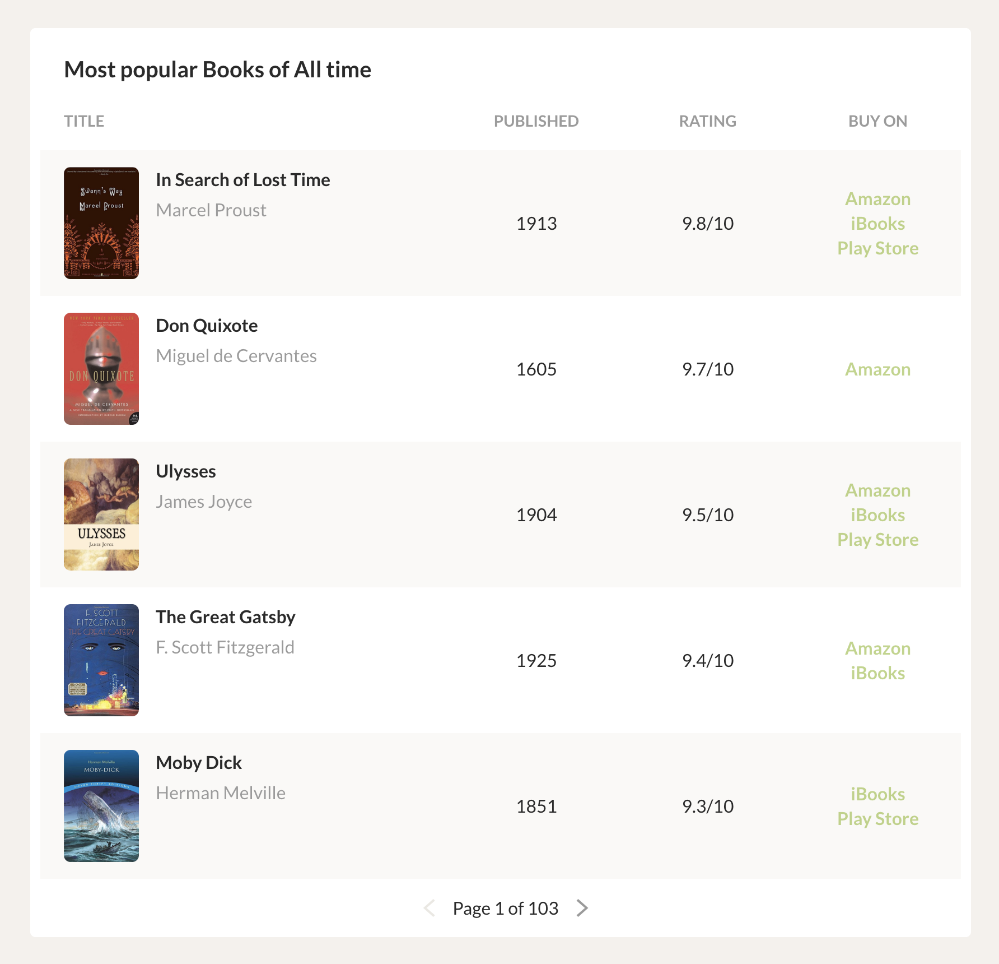

## Challenge

Using AngularJS (1.x), create a basic SPA that implements the following UI.

- Each page should display 5 books.
- A few pages should be available in order for pagination to work.
- Book entries should be clickable and expand/collapse to show/hide more information about the selected book.
- Book stores should only be displayed when the respective URL is available; make different entries as represented on the images so different store availability scenarios are represented.
- Improve the UI as you think works best.

Add test coverage as you see fit.

The project should be responsible for managing all the required dependencies and should run just by using `npm install` and `npm start`.

## Solution

